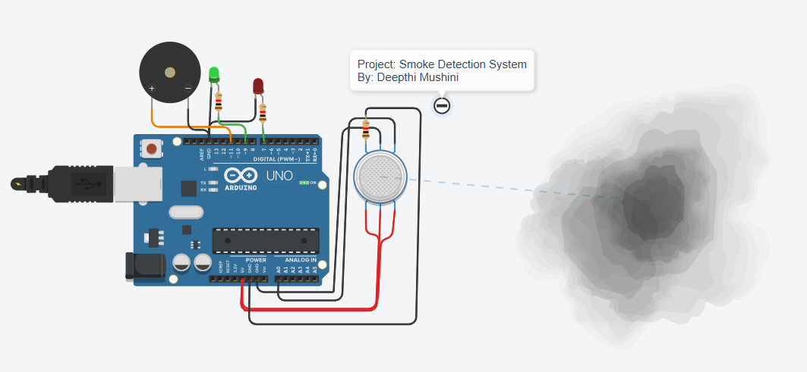
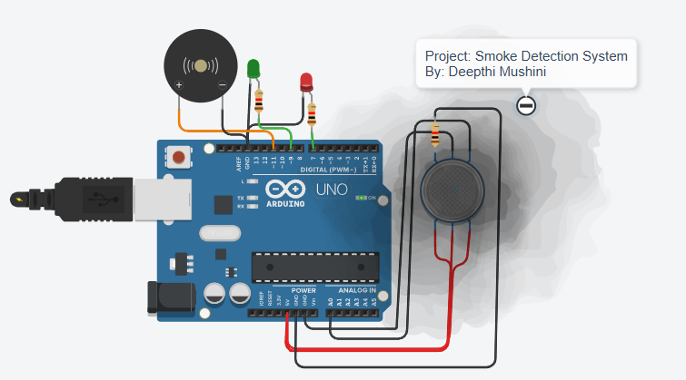

# 🔥 Smoke Detection System using Arduino

An Arduino-based smoke detection system that alerts users when smoke levels exceed a safe threshold. This project simulates a basic fire alarm using a gas sensor, LEDs, and a buzzer — all built and tested on Tinkercad.

---

## 🚀 Features
- 🔍 Detects smoke using an MQ-2 gas sensor
- 🟢 Green LED = Safe
- 🔴 Red LED + Buzzer = Smoke detected
- 🧠 Built using Arduino Uno R3
- 💻 Simulated online (no physical hardware needed!)

---

## 🧰 Tech Stack
- Arduino Uno R3
- MQ-2 Gas Sensor
- Buzzer + LEDs
- Tinkercad (for simulation)
- C++ (Arduino code)

---

## 🔗 Live Simulation

You can try out the smoke detection circuit directly on Tinkercad:

👉 [Click here to simulate the project](https://www.tinkercad.com/things/9aQ0Zg4Gdat-glorious-wluff/editel?tenant=circuits)

---

## 📷 Circuit Diagrams

### 🟢 No Smoke Detected (Safe State)

---

### 🔴 Smoke Detected (Alert State)

---

## 🧠 How It Works
- MQ-2 sensor reads smoke/gas levels
- If value > 50:
  - Red LED turns ON
  - Buzzer beeps
- If value ≤ 50:
  - Green LED turns ON
  - Everything else stays OFF

---

## 📄 Project Report
The full write-up and documentation is available here:  
📄 [`Smoke_Detection_Report.pdf`](Smoke_Detection_Report.pdf)

---

## 💡 Use Cases
- Home fire alarm systems
- IoT smoke monitoring
- School/college safety simulations
- Early warning systems in low-budget environments

---

## 🪪 License

This project is licensed under:  
📜 **Creative Commons Attribution 3.0 (CC-BY 3.0)**  
You're free to use and remix it — just give credit to: **Deepthi Mushini**

---

## 🙌 Credits
Built with ❤️ by Deepthi Mushini  
Made for academic project work @ UMIT, Mumbai

---
